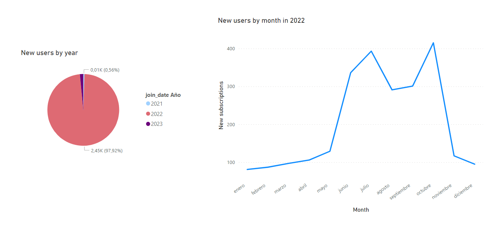

# Netflix_stats

  

# Introducción y origen de los datos

En este proyecto he recopilado y limpiado unos datos de uso de la plataforma Netflix, para realizar un posterior análisis gráfico sobre las tendencias de sus usuarios. Mis fuentes han sido tres:

1) Un archivo csv descargado de [kaggle](https://www.kaggle.com/datasets/arnavsmayan/netflix-userbase-dataset), con un dataset sintético (no son datos reales, sino que reflejan tendencias generales de los usuarios de Netflix).
2) Datos scrapeados de [beebom](https://beebom.com/how-much-netflix-costs-each-country-worldwide/), de las tarifas reales de las suscripciones 'premium', 'standard' y 'basic' en los distintos países.
3) Un archivo csv de la página [worldpopulationreview](https://worldpopulationreview.com/country-rankings/purchasing-power-parity-by-country), del que he sacado los datos de Purchasing Power Parity (PPP) para poder comparar el precio relativo de las suscripciones en los distintos países.
   

# 1. Limpieza y organización 

En el jupyter notebook 'Data_extracting_&_cleanning.ipynb' he ido limpiando y agrupando los distintos datos de estas fuentes. He realizado algunos cambios menores sobre la tabla principal de kaggle, como cambiar el formato de las fechas, eliminar columnas redundantes etc., y la he enriquecido con la información de las otras dos fuentes de la siguiente forma:

+ He sustituido la columna de 'revenue' por los precios reales y actualizados de las distintas suscripciones en cada país, expresados en dólares estadounidenses.
+ He añadido el PPP actual de cada país, y he calculado una columna más con un precio relativo de las suscripciones según dicho valor.

Finalmente he guardado el dataframe resultante en un csv, para importarlo después desde PowerBI.

# 2. Análisis

## Características de nuestro dataset

Empecemos echando un ojo a los datos de los que disponemos. Como es un dataset sintético, puede que haya información muy parcial y necesitamos saber primero con qué datos estamos trabajando:

Vemos que tenemos datos sobre 2500 usuarios diferentes de 10 países distintos, con una mayor representación de algunos como España y Estados Unidos. A la derecha vemos que el aporte económico del total de suscriptores de cada país está aproximadamente en proporción con el tamaño de su muestra. Sumando la contribución de todos vemos que este dataset recoge un total de 32K $ en suscripciones de Netflix.

Revisemos las fechas de suscripción para saber en qué ventana temporal estamos:

La gran mayoría de los datos pertenecen a 2022, y de los otros dos años no tenemos suficientes registros para sacar conlcusiones. Observando las inscripciones de este año, vemos que hubo mayor actividad entre junio y noviembre con dos picos importantes en julio y octubre.

## Análisis de los datos

Una vez acotadas las características del dataset, podemos pasar a analizar diferentes aspectos para sacar conclusiones. Empezamos observando la distribución de edades y de géneros de los suscriptores, así como el porcentaje total de ellos que tenemos en las tres tarifas distintas: premium, standard y basic:

Podemos ver que no hay diferencias significativas en cuanto al uso por género en ningún rango de edad. La mayor parte de los usuarios están entre 30 y 40 años, y en cuanto al tipo de suscripción, la más popular es la tarifa básica en que reúne al 40% de ellos. Las tarifas premium y standard están casi igualadas a un 30% de popularidad.

Vamos a ahondar un poco más en la tarifa premium, que es la que más dinero mueve, agrupando los datos por grupos de edad y género:

La mayor parte de las suscripciones premium que hay registradas están en el rango de edad en torno a 30 años, como podemos ver en el gráfico superior. Sin embargo, si agrupamos por género y estudiamos cada subgrupo de edad por separado, vemos que el subgrupo en que hay mayor porcentaje de suscripción premium es el de mujeres en torno a los 25 años, por lo que podría ser interesante estudiar mejor ese colectivo de cara a futuras estrategias publicitarias.

Analicemos ahora la distribución geográfica de las suscripciones: 

En el gráfico de barras de la izquierda vemos el precio medio de las suscripciones de Netflix en cada país, muliplicado por el valor del parámetro PPP correspondiente. Esto nos da una idea de lo caro que es el producto teniendo en cuenta la realidad económica de cada lugar.

Si nos fijamos, México, que es el que mayor precio relativo muestra, es el único de todo el mapa de la derecha en que no hay casi usuarios con suscripción premium. En el resto de países hay mayor diversidad, con la excepción de Francia en que no hay apenas usuarios con tarifa básica. En ambos países la muestra es relativamente pequeña, pero si es efectivamente representativa, nos da un punto de vista interesante sobre el tema.

Por último, un gráfico más específico nos induce a pensar que sí podría haber una relación (inversa) entre el precio relativo de la suscripción premium y el porcentaje de suscriptores que tienen dicha tarifa.

Los dos países que más se alejan de esta relación son Alemania e Italia, pero son de los países con muestras más pequeñas y podrían ser poco representativos.

## Conclusiones

A modo de cierre, podríamos concluir que hay una correlación entre el contexto económico de los distintos países y el consumo de la suscripción premium de Netflix, así como diferencias entre las tendencias de uso dentro de los subgrupos de edad y género.

Un dataset más completo permitiría sacar mejores conclusiones, ya que [según otras fuentes](https://es.statista.com/estadisticas/636438/numero-de-abonados-al-servicio-de-emision-continua-de-netflix-en--por-pais/#:~:text=En%202021%2C%20Estados%20Unidos%20se,segunda%20y%20tercera%20posici%C3%B3n%2C%20respectivamente.) hay muchos países con una proporción mayoritaria de usuarios de esta plataforma que apenas están representados en esta muetra.
